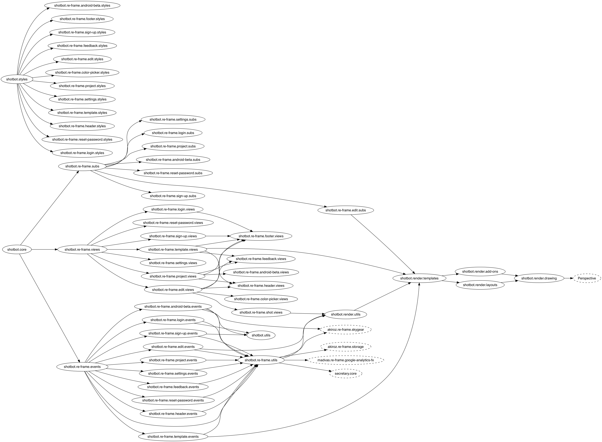

## Source Files

```
├── project.clj                                 # project info, dependencies, build spec
├── resources/
│   └── public                                  # server root
│       ├── index.html                          # landing page (copied from landing repo)
│       ├── landing-assets/                     # landing page assets (copied from landing repo)
│       ├── app.html                            # main browser entry point
│       ├── asset/                              # screenshot template BGs, badges, etc.
│       ├── img/                                # icons, logos, banners, etc.
│       ├── css/
│       │   └── compiled/                       # compiled CSS (directory will be cleaned)
│       └── js/
│           └── compiled/                       # compiled JS (directory will be cleaned)
│
├── src/                                        # dir structure mirrors namespace (like java projects)
│   ├── cloud/
│   │   ├── templates/
│   │   │   └── forgot_password/
│   │   │       └── forgot_password_email.txt   # reset password email template
│   │   └── __init__.py                         # Cloud Code entry point
│   ├── js/
│   │   └── perspective-draw.js                 # Canvas perspective-transform emulation (from stackoverflow)
│   ├── cljs/
│   │   └── shotbot/
│   │       ├── core.cljs                       # JS entry point
│   │       ├── re_frame/
│   │       │   ├── views.cljs                  # common views & registry
│   │       │   ├── subs.cljs                   # common subs & registry
│   │       │   ├── events.cljs                 # common events & registry
│   │       │   ├── login/                      # login panel 
│   │       │   ├── sign_up/                    # sign-up panel 
│   │       │   ├── reset_password/             # reset-password panel 
│   │       │   ├── project/                    # project selection panel
│   │       │   ├── template/                   # template selection panel
│   │       │   ├── edit/                       # project editing panel
│   │       │   ├── feedback/                   # feedback button
│   │       │   ├── android_beta/               # android beta sign up box
│   │       │   ├── settings/                   # settings modal
│   │       │   ├── header/                     # project header component
│   │       │   ├── shot/                       # shot rendering component
│   │       │   ├── color_picker/               # re-frame component for jscolor
│   │       │   └── utils.cljs                  # re-frame (co)fx / interceptor / custom registry fns / URL routing
│   │       └── render/
│   │           ├── templates.cljs              # screenshot template data
│   │           ├── add_ons.cljs                # add-on layout fns
│   │           ├── layouts.cljs                # shot layout fns
│   │           ├── drawing.cljs                # canvas drawing fns (used by layout fns)
│   │           └── utils.cljs                  # rendering utility fns
│   └── garden/
│       └── shotbot/
│           ├── styles.clj                      # CSS entry point
│           └── re_frame/                       # same structure as cljs/shotbot/re_frame/ but contains styles
│
└── target                                      # compiled intermediate files (directory will be cleaned)

```

## Namespace Graph



## Deploy to Skygear Cloud

Clone the project, run one of these in the project root:

```
$ lein deploy-staging! 
$ lein deploy-production!
```

Navigate to `shotbot.skygeario.com/static` or `shotbotstaging.skygeario.com/static`.

## Start Development Server

Clone the project, run this in the project root:

```
$ rlwrap lein dev
```

`rlwrap` is optional, it makes the arrow keys work in the REPL.

Main App: `localhost:3449`
Dev Console: `localhost:4567`


## Guidelines

- Name the anonymous functions in re-frame events, subs and views
  for a better debugging experience. (Follow the existing naming convention)

- Audit your dependencies...
  - Prefer using the [google closure library][goog], it's built-in.

- Clojure(Script) provides a lot of freedom...
  - Avoid using [macros][macros], they are very difficult to debug.
  - Prefer functional / reactive programming [FRP][frp] over imperative / OOP.

- Use the [cljs-oops][oops] library to retrieve or set nested JS data structures.

[oops]: https://github.com/binaryage/cljs-oops
[frp]: https://en.wikipedia.org/wiki/Functional_reactive_programming
[macros]: http://clojure.org/reference/macros
[clojurians]: http://clojurians.net/

## Getting Help

In case googling didn't help, you may join [clojurians][clojurians] on slack and
ask for help in either **#beginners**, **#clojurescript**, **#re-frame** or which ever
channel suits your problem best. You may also DM me **@akiroz**.
