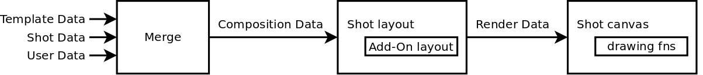

## The shot rendering pipeline

The rendering system consists of types of data structures:

- Composition data contains high level information about the shot such as color, text content,
resolution and device model etc. It's a plain clojure data structure.

and

- Rendering data contains a set of image URLs to be asyncronusly loaded, a list of input
  fields required by the shots and a rendering function which takes a canvas 2D context
  and draws on it.

--------------------------------------------------------------------------------

Composition data has 3 levels, higher level data will override lower ones. They are:

- Template-wide data (resolution, colors, device, etc.)
- Shot-specific data (badges, default text, etc.)
- User input data (overrides default values)

Template and Shot level data are stored in `shotbot.render.templates/templates` while
User level data is stored in a Shot Record in skygear's database.

--------------------------------------------------------------------------------

The layout functions take a composition data map and returns a render data map
which consists of:

- `:resolution [width-px height-px]`
- `:inputs []` vec of inputs availiable for this layout
- `:images #{}` set of image URLs required by this layout
- `:render (fn [images ctx])` render function expecting a map of
  image URL => image HTMLElement and a canvas rendering context,
  returns ctx in the same state as it was given.
